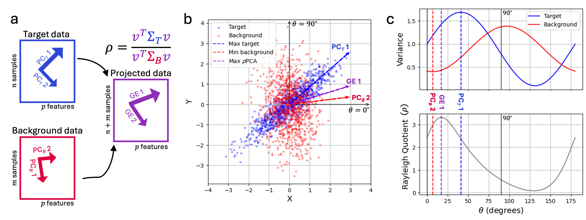

# ρPCA


The rhopca package implements the ρPCA method for contrastive PCA of single-cell RNA-seq data. The ρPCA method amounts to generalized eigenvalue decomposition for the target and background datasets, and finds axes that maximize variation in the target samples while minimizing variance in the background samples. The rhopca package is compatible with anndata objects. 



## Installation

### From PyPI

This package can be installed directly from PyPI:

```bash
pip install rhopca
