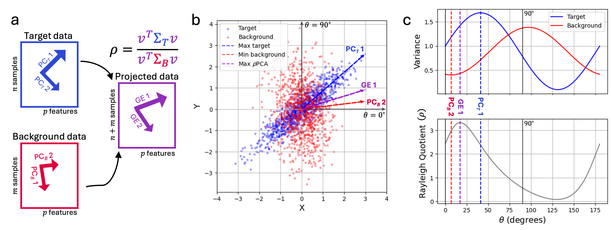

# ρPCA


The `rhopca` package implements ρPCA, a method for contrastive dimension reduction. ρPCA finds axes that optimizes a Rayleigh quotient to maximize variance in a target dataset while minimizing variance in a background (control) dataset, making it well-suited for identifying condition-specific signals in genomics data. Mathematically, this is achieved by solving a generalized eigenvalue problem. The package also provides kernel ρPCA, which extends the method to nonlinear settings via kernel functions, and functional ρPCA, which operates on functional data such as gene expression measured across time. The package is compatible with `anndata` objects and integrates into standard single-cell analysis workflows.

The repository for reproducing the figures in the manuscript is available at https://github.com/pachterlab/CJP_2025/tree/main.



## Installation

### From PyPI

This package can be installed directly from PyPI:

```bash
pip install rhopca
```

### From Github

This package can also be installed from Github:

```bash
!pip install git+https://github.com/pachterlab/rhopca.git

```

## Citation

If you use `rhopca` in your work, please cite:

```bibtex
@article {Carilli2025.11.19.689125,
    author = {Carilli, Maria and Jackson, Kayla and Pachter, Lior},
    title = {The Rayleigh Quotient and Contrastive Principal Component Analysis I},
    elocation-id = {2025.11.19.689125},
    year = {2025},
    doi = {10.1101/2025.11.19.689125},
    publisher = {Cold Spring Harbor Laboratory},
    URL = {https://www.biorxiv.org/content/early/2025/11/19/2025.11.19.689125},
    journal = {bioRxiv}
}
```

